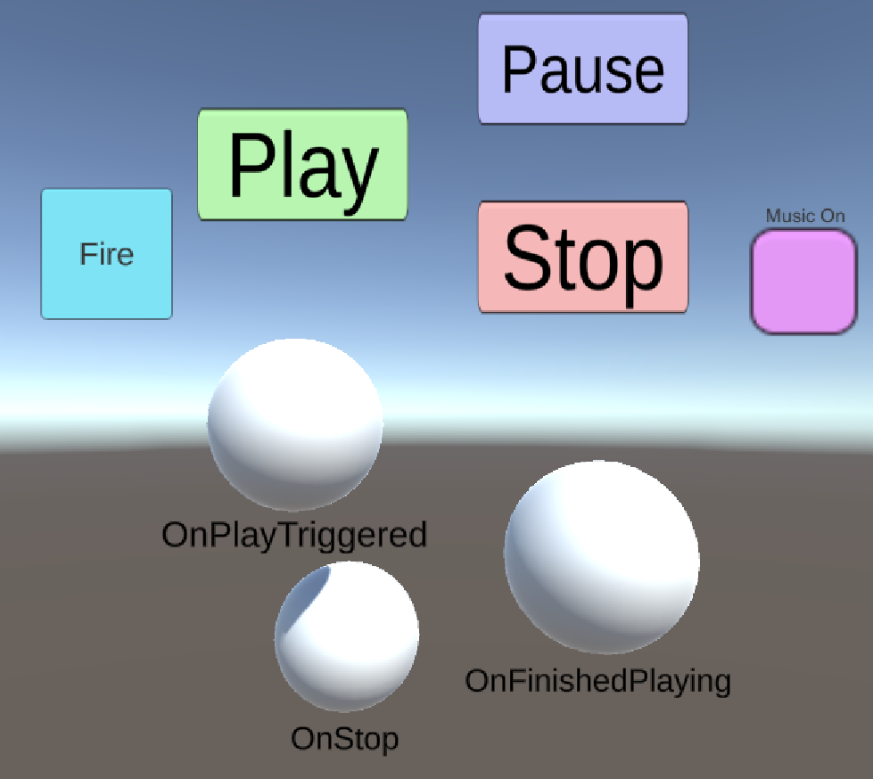
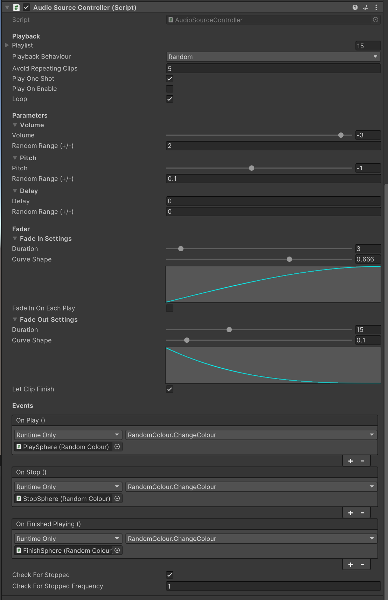

# AudioSourceController

An all-in-one script that extends Unity's built-in Audio Source component designed with solo devs and game jammers in mind. Handles various advanced playback techniques including looping multiple clips, lots of randomisation, highly customisable fades and callbacks.

## Overview

A video showing the main functions of the Audio Source Controller:

## Installation

Just copy the AudioSourceController.cs file into your Unity Assets folder. For best results, use the custom property drawers found in the Editor folder. Make sure they're in a folder marked Editor in your Assets folder or they tend to wreak havoc on builds, especially WebGL.

Test it's working by adding some clips to the `Playlist`, and calling Play and Stop, for example using `Input.GetKeyPressed` or connecting a button press to the different functions.

## Breakdown

The Audio Source Controller (ASC) can be broken down into Playback, Parameters, Fades and Events.

### Playback

#### Functions

**Play**: Plays a clip from the Playlist with the current volume, pitch and delay settings.

**Pause**: Pauses playback. A short fade out is applied of the duration set in `PauseFadeTime` (default: 0.2s) to avoid audible pops.

**UnPause**: Unpauses playback. A fade in is applied of the same length as above.

**TogglePaused**: Switches between paused and unpaused states.

**Stop**: Stops all playback from the Playlist.

**StopLooping**: Stops the looper, but doesn't stop the current clip or trigger any fade outs.

#### Settings

A list of Audio Clips are held by the ASC in `Playlist`, although the current clip can be directly assigned in code by setting `Clip`. The way the clips are chosen from the playlist depends on the other playback settings, mainly `Playback Behaviour`:

**Single**: Repeats the last clip (or first in the Playlist if playing for the first time). If looping with no delay, this behaves just like the Unity native looper so can still be used with seamless loops.

**Sequential**: Plays the next clip in order. Useful for creating music playlists, for example.

**Random**: Chooses a new clip at random. It keeps track of the last few clips that have been played, according to the `Avoid Repeating` setting, and avoids playing those clips until others have been played first, which is a good way of reducing audible repetition for easily recognisable sounds like vocal barks.

You are able to loop all types of playback behaviour.

By default, the ASC uses AudioSource.Play, but if you enable `PlayOneShot` it uses AudioSource.PlayOneShot. The main upside of this is you can play overlapping clips as it spawns a new instance of the audio source. However clips played with PlayOneShot can't loop (since they are not tracked and as such would never stop), and they will also stay at the position they were started, so can't be used for any sounds you need to attach to a transform. Also, you shouldn't have too many concurrent audio sources playing as it will start eating up processing power (24 is usually the hardware limit in Unity), and it's harder to keep track of that with PlayOneShot, so use sparingly. 

Finally, if `LetClipFinish` is enabled, the ASC will wait until the current clip has finished to stop playback. During this time, new calls to Play will interrupt this behaviour. If there is a fade out applied to the ASC, this fade will happen as if it were attached to the end of the clip. Eg. with a 10 second clip and a 3 second fade, the fade will start at 7 seconds. In conjunction with `FadeInOnEachPlay`, this can create an envelope for each clip (as long as stop is called after play). If the remaining time is less than the length of the fade, it will fade out over the remaining time.

### Parameters

#### Settings

Each parameter (`Volume`, `Pitch` and `Delay`) follow the same pattern in the Inspector and code structure. The holding of the actual value internally, and the one that connects to the Audio Source component, is not directly accessible but can be accessed either through the Inspector through the serialised Parameter class or in code through a property of the same name (`ASC.Volume`, for example). 

Each parameter has a random range field which +/- around the centre value each time a new clip is played back.

The ultimate values are always clamped to the minimum and maximum values of the Parameter class. I wouldn't advise changing these, although changing the Pitch ones should be fine if you want a different range of pitch changing.

Volume is in **decibels** which produce much more natural sounding fades and a more intuitive visual interface. It also means that if you want to, for instance, change the volume of multiple ASCs together, say for a pause menu, you can call `ASC.Volume -= 6f` to more or less half their loudness regardless of which level they're at, whereas calling `AudioSource.volume -= 0.1` would give you wildly different changes in volume. The limits are set at the top of the ASC script under `MINIMUM_VOLUME` and `MAXIMUM_VOLUME`.

Pitch is in **semitones**, which again is because it's more intuitive. The default range is from -12 (an octave below, or half the speed) to +12 (an octave above, or twice the speed).

If looping is disabled, delay is applied **before** the clip plays. This is useful when lining up sounds with other sounds without having to create coroutines at the point of triggering, or for linking with visual effects which have different timing. If looping is enabled, it is applied **between** clips being played. I've used this for example in an ASC that handled birdsong in a forest environment, playing back different bird calls every 10-15 seconds.

### Fade

#### Functions

**FadeIn** Fades in to the set Volume level over the duration set in Fade In Settings. Note this will not play the sound.

**FadeOut** Fades out to silence over the duration set in Fade Out Settings. Note this will not stop the sound after finishing.

**FadeTo** Fades to the given volume level over a given duration. If the target level is higher than the current volume, it will use the Fade In Curve; otherwise it'll use the Fade Out Curve.

#### Settings

Each ASC has two fades, Fade In and Fade Out. Fade In is triggered whenever Play is called, Fade Out whenever Stop is called.
The fade time is adjustable with the `Duration`. If set to zero this will technically call the fade but it will snap to the target volume immediately. This is to keep the internal OnFadeEnd callback functional so that it can update the play state accordingly.

The actual curve defines the rate at which the volume changes over time. It can be adjusted either directly (it's an animation curve) or by using the `Curve Shape` slider to interpolate between an exponential curve at 0, an s-curve at 0.5 and a logarithmic curve at 1.

**Exponential**: Starts slowly and gets faster. Great for realistic-sounding fades and especially long fade-outs.

**Logarithmic**: A constant power-like fade, starts quickly and then slows down. Great for transitions and crossfades.

**S-Curve**: A smooth fade suitable for most situations, although performs better with shorter fades.

As mentioned above, `FadeInOnEachPlay` re-triggers the fade each time Play is called, meaning the Fade In works more as an attack envelope, and lets you shape the sound a bit.

### Events

The ASC also produces several callbacks which can be connected to other gameplay elements or to help when managing them.

**OnPlay**: Triggers whenever a new clip is selected and played.

**OnStop**: Triggers whenever Stop is triggered. Only triggers if it's already playing. This starts before any fade out but does allow for any wait time invoked by `Let Clip Finish`.

**OnFinishedPlaying**: Triggers once ASC is certain there is no clip playing and no loop active. Does not apply to sounds triggered with `PlayOneShot` as they are not tracked. This may not trigger exactly when the sound audibly ends. It's better used to find out for sure that the source can be disabled, destroyed or moved eg. for pooling.
 

## Testing

If you're using the Audio Source Controller in a project I'd love to hear what worked/didn't work. I'm open to any suggestions for features to be added to later versions!